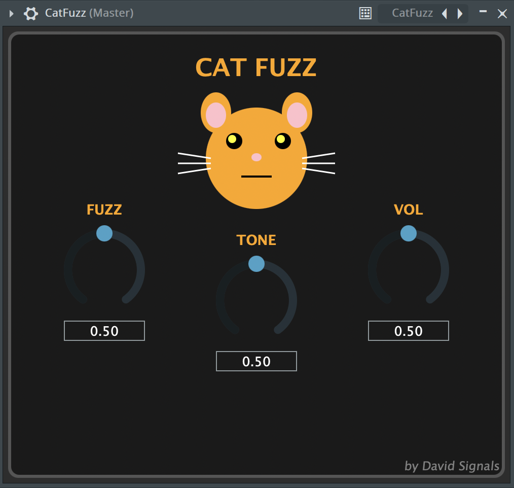
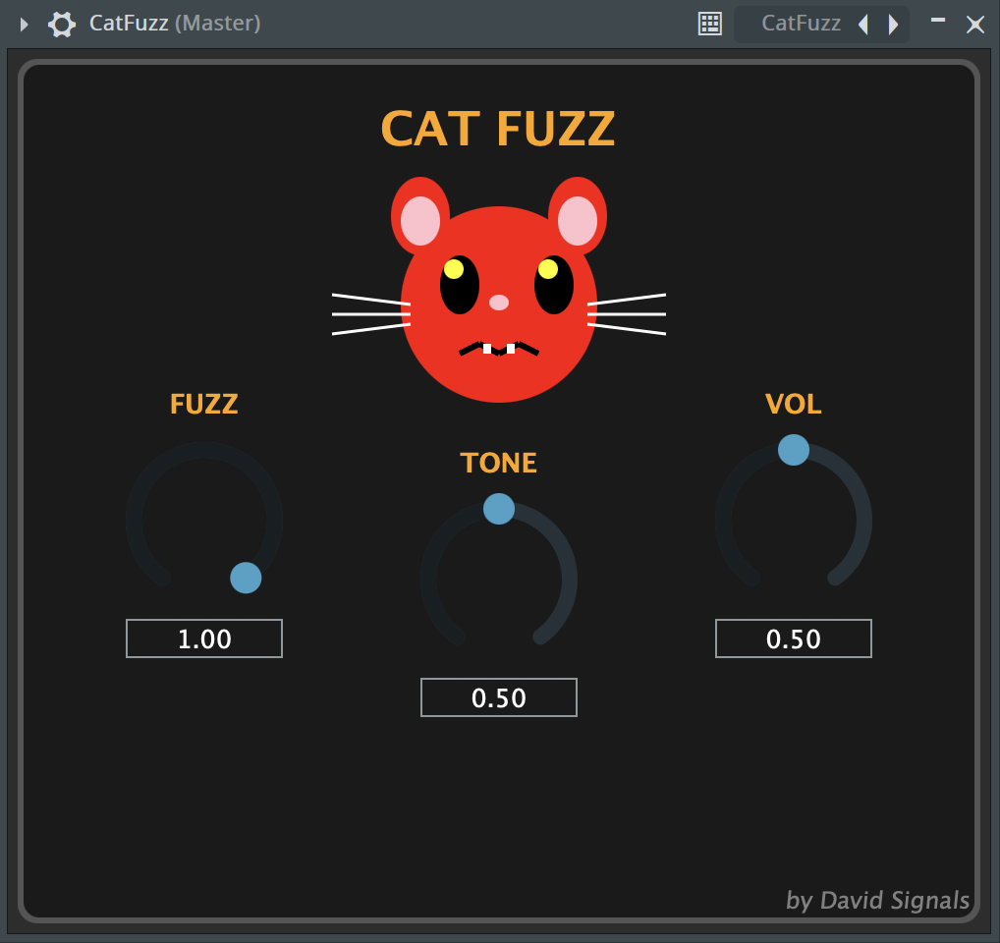

# 🎸 CatFuzz - Audio Plugin

<div align="center">


*A fuzz pedal inspired by Big Muff and Fuzz Face with interactive feline interface*

</div>

## 🎛️ Features

- **Hybrid Algorithm**: Combines Fuzz Face (smooth) and Big Muff (aggressive) characteristics
- **Visual Interface**: Animated cat that reacts to fuzz parameter
- **3 Controls**: Fuzz, Tone, Volume
- **Formats**: VST3, AU (Audio Unit)

## 📸 Screenshots

<div align="center">

### Low Fuzz Setting (Calm Cat)


### Mid Fuzz Setting (Neutral Cat)


### High Fuzz Setting (Angry Cat)  


</div>

## 🎚️ Controls

| Parameter | Range | Description |
|-----------|-------|-------------|
| **Fuzz** | 0.0 - 1.0 | Main distortion control + cat animation |
| **Tone** | 0.0 - 1.0 | Tone filter (dark to bright) |
| **Volume** | 0.0 - 1.0 | Output level |

## 🛠️ Development

### Technologies
- **JUCE Framework** 8.0.10
- **C++17**
- **Xcode** (main IDE)

## 🚀 Installation

1. **Clone repository**:
   ```bash
   git clone https://github.com/davidsignals/CatFuzz.git

